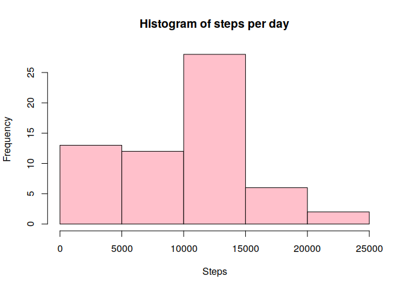
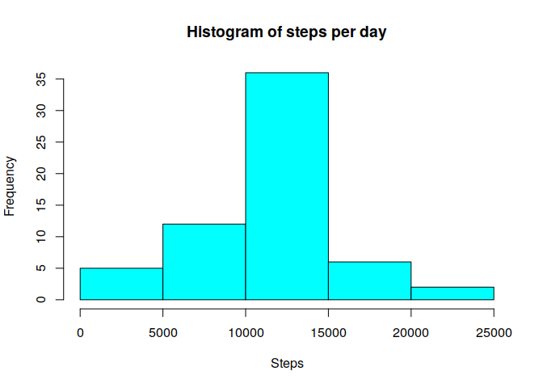
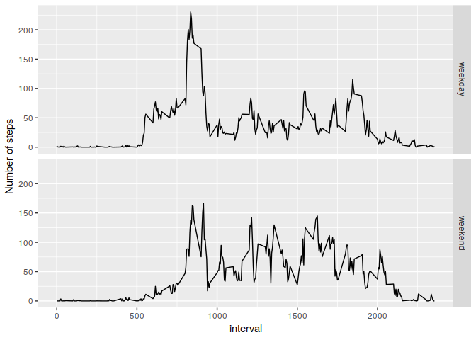

```r
library(dplyr)
library(timeDate)
library(ggplot2)
library(knitr)
```


## Loading and preprocessing the data

```r
dataUrl <- 'https://d396qusza40orc.cloudfront.net/repdata%2Fdata%2Factivity.zip'
download.file(dataUrl, destfile = './data_set.zip')
unzip(zipfile = './data_set.zip', exdir = './')

data <- read.csv('activity.csv')
```
The data have been downloaded and loaded in the data frame "data".

## What is mean total number of steps taken per day?

1. We create a data frame "steps_per_day" with two columns: one contains the 
dates of the days, and the second the total number of steps taken that day.
NA values are removed. The type of the dates is converted from "factor" to "date".

```r
steps_per_day <- aggregate(data$steps, list(data$date), sum, na.rm=TRUE)
names(steps_per_day) <- c('date', 'steps')
steps_per_day$date <- as.Date(steps_per_day$date, format = "%Y-%m-%d")
```
The first ten rows of the "steps_per_day" data frame are

```r
head(steps_per_day, 10)
```

```
##          date steps
## 1  2012-10-01     0
## 2  2012-10-02   126
## 3  2012-10-03 11352
## 4  2012-10-04 12116
## 5  2012-10-05 13294
## 6  2012-10-06 15420
## 7  2012-10-07 11015
## 8  2012-10-08     0
## 9  2012-10-09 12811
## 10 2012-10-10  9900
```
2. Histogram of the total number of steps taken each day:

```r
hist_steps_per_day <- hist(steps_per_day$steps, 
                           main = "Histogram of steps per day", 
                           xlab = "Steps", 
                           col = "pink")
```

<!-- -->

3. The mean number of steps taken each day is

```r
mean_steps_per_day <- mean(steps_per_day$steps)
mean_steps_per_day
```

```
## [1] 9354.23
```
The median number of steps taken each day is

```r
median_steps_per_day <- median(steps_per_day$steps)
median_steps_per_day
```

```
## [1] 10395
```

## What is the average daily activity pattern?

1. We create a data frame "intervals" with two columns: one contains the 
5-minute intervals, and the second the average number of steps taken
in that interval, averaged across all days.
NA values are removed. 

```r
intervals <- aggregate(data$steps, list(data$interval), mean, na.rm=TRUE)
names(intervals) <- c('interval', 'steps')
```
The first ten rows of the "intervals" data frame are

```r
head(intervals, 10)
```

```
##    interval     steps
## 1         0 1.7169811
## 2         5 0.3396226
## 3        10 0.1320755
## 4        15 0.1509434
## 5        20 0.0754717
## 6        25 2.0943396
## 7        30 0.5283019
## 8        35 0.8679245
## 9        40 0.0000000
## 10       45 1.4716981
```

Time series plot of the 5-minute interval (x-axis) and the average number of steps taken, averaged across all days (y-axis):

```r
tseries_intervals <- plot(x = intervals$interval, 
                          y = intervals$steps, 
                          type = 'l', 
                          xlab ='Intervals', 
                          ylab = 'Steps', 
                          main = "Steps per interval", 
                          col = 'salmon')
```

<!-- -->

2. The 5-minute interval that, on average, contains the maximum number of steps is

```r
max_interval <- intervals$interval[which.max(intervals$steps)]
max_interval
```

```
## [1] 835
```

## Imputing missing values

1. The total number of missing values in the dataset is

```r
number_of_missing_values <- sum(!complete.cases(data)) 
print(number_of_missing_values)
```

```
## [1] 2304
```

2. We replace the missing values with the mean of the 5-minute interval they belong to.
3. We create the data frame "complete_data" with missing data filled.

```r
y = list()
for (x in 1:length(unique(data$interval))){ y[[x]] <- subset(data, interval == unique(data$interval)[x]) }
for (x in 1:length(y)) { y[[x]]$steps[is.na(y[[x]]$steps)] <- mean(y[[x]]$steps, na.rm = TRUE)}

complete_data <- arrange(bind_rows(y), date)
```

4. We apply the analysis that was applied to the data frame "data" in the first section, to the
data frame "complete_data":

```r
c_steps_per_day <- aggregate(complete_data$steps, list(complete_data$date), sum, na.rm=TRUE)
names(c_steps_per_day) <- c('date', 'steps')
c_steps_per_day$date <- as.Date(c_steps_per_day$date, format = "%Y-%m-%d")
head(c_steps_per_day, 10)
```

```
##          date    steps
## 1  2012-10-01 10766.19
## 2  2012-10-02   126.00
## 3  2012-10-03 11352.00
## 4  2012-10-04 12116.00
## 5  2012-10-05 13294.00
## 6  2012-10-06 15420.00
## 7  2012-10-07 11015.00
## 8  2012-10-08 10766.19
## 9  2012-10-09 12811.00
## 10 2012-10-10  9900.00
```

```r
c_hist_steps_per_day <- hist(c_steps_per_day$steps, 
                           main = "Histogram of steps per day", 
                           xlab = "Steps", 
                           col = "cyan")
```

<!-- -->

Mean:

```r
c_mean_steps_per_day <- mean(c_steps_per_day$steps)
c_mean_steps_per_day
```

```
## [1] 10766.19
```

Median:

```r
c_median_steps_per_day <- median(c_steps_per_day$steps)
c_median_steps_per_day
```

```
## [1] 10766.19
```
We observe that imputing missing data, raises the values of the estimates of the total daily number of steps, mean and median.

## Are there differences in activity patterns between weekdays and weekends?

1. We create a new factor variable in the "complete_data" data frame with two levels – “weekday” and “weekend” indicating whether a given date is a weekday or weekend day.

```r
complete_data$day <- factor((isWeekend(complete_data$date)), levels = c(FALSE, TRUE), labels = c('weekday', 'weekend'))

steps_per_wday <- aggregate(complete_data$steps, list(complete_data$day, complete_data$interval), mean)
names(steps_per_wday) <- c('day', 'interval', 'steps')
```

2. We make a panel plot containing a time series plot of the 5-minute interval (x-axis) and the average number of steps taken, averaged across all weekday days or weekend days (y-axis).

```r
ggplot(steps_per_wday, aes(y = steps, x = interval)) + geom_line() + facet_grid(vars(day)) + ylab('Number of steps')
```

<!-- -->

We observe that the activity patterns between weekdays and weekends are different.
